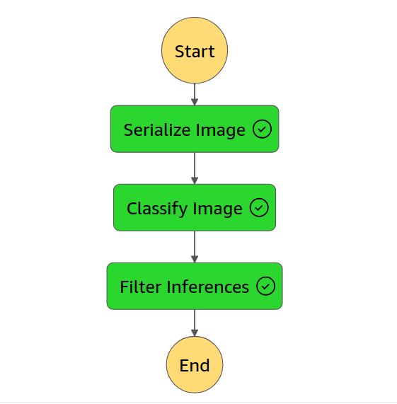

# VehicleVision
## Project Overview
The core objective of VehicleVision is to craft an image classification model that excels at differentiating between bicycles and motorcycles.

## Project Objectives
1. Precise Image Classification: Engineer a robust model capable of accurately categorizing images as bicycles or motorcycles.

2. Scalable Deployment: Utilize AWS Sagemaker to deploy the model in a scalable manner, accommodating varying demand.

3. Automated Workflow: Develop AWS Lambda functions to streamline data preprocessing and orchestrate their execution using AWS Step Functions.

4. Thorough Testing: Construct a comprehensive testing and evaluation framework to ensure both the model and the workflow's dependability.

5. Monitoring and Maintenance: Implement mechanisms to actively monitor model performance and identify potential anomalies.

## Project Phases
### Phase 1: Data Preparation
Prepare the dataset for model training:

1. Extract data from a designated source.
2. Transform data into a suitable format for training.
3. Load processed data into a suitable storage system.
### Phase 2: Model Training and Deployment
Train and deploy the image classification model:

1. Utilize AWS's image classification algorithm for model training.
2. Deploy the trained model to AWS Sagemaker endpoint.
3. Configure AWS Model Monitor to track deployment performance.
### Phase 3: Lambda Functions and Workflow Orchestration
Develop AWS Lambda functions and orchestrate their execution:

1. Create three distinct AWS Lambda functions: serialize image (`serializeImage.py`) , classify image (`classifyImage.py`), and result filtering (`filterInferences.py`).
2. Design a workflow using AWS Step Functions to coordinate these functions (`stepFunction.json`). 

- Step Function Workflow:
 
### Phase 4: Testing and Evaluation
Thoroughly assess the workflow's effectiveness:

1. Invoke the step function with test data.
2. Validate successful and unsuccessful workflow executions.
3. Utilize SageMaker Model Monitor insights to visualize model behavior.
